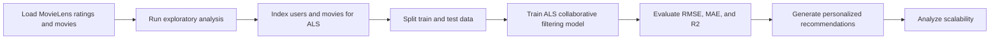

# ALS Spark Movie Recommendation System

[](https://www.python.org/)
[](LICENSE)

A scalable movie recommendation project built around an Apache Spark and PySpark implementation of Alternating Least Squares (ALS) collaborative filtering. The main project walkthrough now lives in `Movie_Recommender_System.ipynb`, where the full pipeline covers data loading, exploratory analysis, preprocessing, ALS training, evaluation, recommendation generation, and scalability analysis.

## Main Artifact
- `Movie_Recommender_System.ipynb`: end-to-end notebook for the ALS recommender workflow

## Project Highlights
- Apache Spark session setup for scalable data processing
- MovieLens-based recommendation workflow
- ALS collaborative filtering with PySpark MLlib
- Evaluation using `RMSE`, `MAE`, and `R2`
- Hyperparameter exploration for rank, regularization, and iterations
- Personalized recommendation generation for sample users
- Scalability analysis across different data sizes

## Workflow


## Repository Layout
```text
ALS-SPARK-MOVIE-RECOMMENDATION-SYSTEM/
|-- .github/
|   `-- workflows/
|       `-- tests.yml
|-- data/
|   `-- sample_movies.csv
|-- examples/
|   `-- run_demo.py
|-- src/
|   |-- __init__.py
|   |-- cli.py
|   |-- dataset.py
|   `-- recommender.py
|-- tests/
|   |-- test_dataset.py
|   `-- test_recommender.py
|-- Movie_Recommender_System.ipynb
|-- .gitignore
|-- LICENSE
|-- README.md
`-- requirements.txt
```

## Notebook Coverage
The notebook is organized into these sections:
1. Environment setup
2. Spark session initialization
3. Data loading
4. Exploratory data analysis
5. Data preprocessing
6. ALS model training
7. Model evaluation
8. Hyperparameter tuning
9. Recommendation generation
10. Scalability analysis
11. Conclusion and future work

## Dataset
The notebook is written around the MovieLens recommendation datasets.
- Primary target: `MovieLens 20M`
- Demo-friendly fallback: `ml-latest-small`

## Running The Notebook
1. Install the dependencies you need for Spark and analysis.
2. Open `Movie_Recommender_System.ipynb` in Jupyter or Google Colab.
3. Run the notebook cells in order.
4. Update dataset paths if you want to switch from the small dataset to the full MovieLens dataset.

Example dependency install:
```sh
python -m pip install pyspark findspark pandas matplotlib seaborn
```
