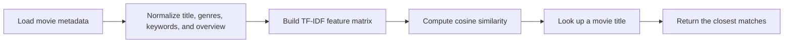

# ALS Spark Movie Recommendation System

[](https://www.python.org/)
[](LICENSE)

A clean starter project for building a scalable movie recommendation pipeline. This baseline currently ships with a content-based recommender, a CLI entrypoint, sample movie data, unit tests, and a lightweight structure that is easy to extend into a PySpark ALS collaborative-filtering workflow next.

## Highlights
- Content-based recommendation using TF-IDF and cosine similarity
- CSV dataset loader with validation and normalization
- Command-line workflow for quick recommendations
- Sample dataset for immediate experimentation
- Unit tests for loader and recommendation behavior
- GitHub Actions workflow for automated test runs
- Repo structure ready for future Spark ALS expansion

## Recommendation Flow


## Project Layout
```text
ALS-SPARK-MOVIE-RECOMMENDATION-SYSTEM/
|-- .github/
|   `-- workflows/
|       `-- tests.yml
|-- data/
|   `-- sample_movies.csv
|-- examples/
|   `-- run_demo.py
|-- src/
|   |-- __init__.py
|   |-- cli.py
|   |-- dataset.py
|   `-- recommender.py
|-- tests/
|   |-- test_dataset.py
|   `-- test_recommender.py
|-- .gitignore
|-- LICENSE
|-- README.md
`-- requirements.txt
```

## Quickstart
1. Create a virtual environment if you want an isolated setup.
2. Install dependencies:
   ```sh
   python -m pip install -r requirements.txt
   ```
3. Run the example CLI:
   ```sh
   python -m src.cli --title "Interstellar"
   ```

## Run The Project
Get recommendations from the sample dataset:
```sh
python -m src.cli --title "The Matrix" --top-n 3
```

Run the demo script:
```sh
python examples/run_demo.py
```

Run the tests:
```sh
python -m unittest discover -s tests
```

## Data Schema
The recommender expects a CSV file with these columns:
- `title`
- `genres`
- `keywords`
- `overview`

The sample dataset already follows this schema.

## How The Baseline Model Works
- Titles and metadata are normalized into a single feature string
- A TF-IDF vectorizer converts text into numeric features
- Cosine similarity ranks related movies
- Recommendations exclude the selected source title

## Roadmap To ALS
- Replace the sample CSV with MovieLens ratings data
- Add PySpark-based ALS training and evaluation
- Introduce user and item embeddings for collaborative filtering
- Compare TF-IDF baseline performance against ALS recommendations
- Expose the recommender through FastAPI or Streamlit
